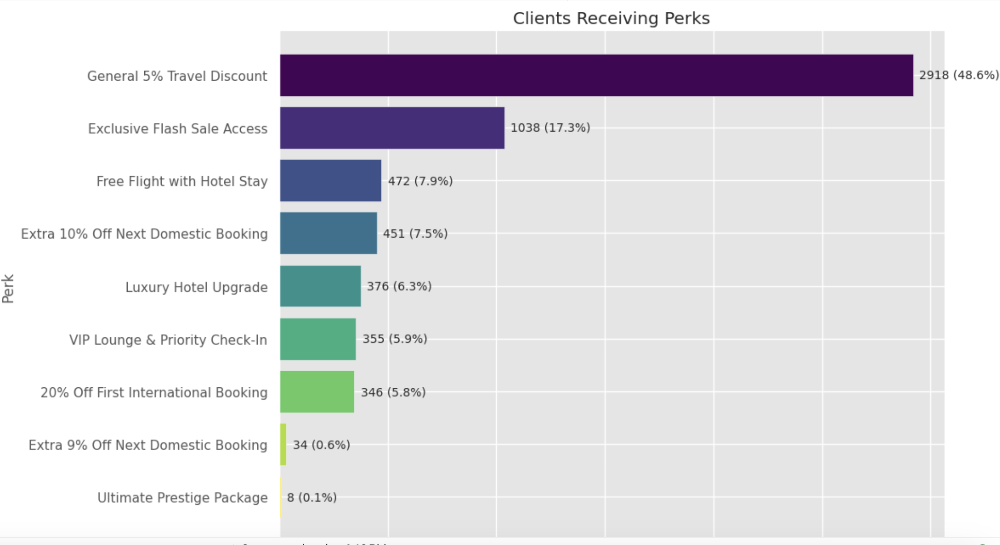

# TravelTide Customer Segmentation Analysis

## Project Description
This project focuses on customer segmentation and perk optimization for TravelTide, a fast-growing e-booking startup. The goal is to improve customer retention by providing personalized rewards based on user behavior and engagement patterns.This project analyzes TravelTide's user engagement and performance metrics, leveraging data insights to improve platform functionality and user experience.

## Project Summary

This repository contains an analysis of TravelTide’s user behavior and spending habits, leading to data-driven recommendations for perk assignments.

## Key Points and Insights:

-  **Customer Segmentation:** K-Means clustering was applied to segment users based on demographics, travel frequency, and booking patterns. The segmentation allowed us to identify distinct user groups with varying levels of spending and engagement.

-  **Booking Trends:** The majority of users engage with the platform multiple times before completing a booking. Repeat visitors show a significantly higher conversion rate, reinforcing the importance of sustained engagement.

-  **Preferred Perks:** The analysis confirmed that users have distinct preferences for perks. Budget-conscious travelers favor discounts, while frequent flyers are more interested in priority services and upgrades.

-  **Cancellation Behavior:** A segment of users demonstrates a high cancellation rate, necessitating flexible booking options to reduce churn and enhance retention.

-  **Spending Patterns:** High-value users, particularly luxury travelers and business clients, tend to bundle hotel and flight bookings, making them ideal candidates for exclusive rewards and premium services.

-  **Model Evaluation:** Random Forest was used to assess the segmentation model’s effectiveness, confirming that user behavior and travel spending can reliably predict perk preferences.

-  **Optimization Goal:** The project aims to refine the perk assignment strategy to maximize retention and improve booking conversion rates through targeted, data-driven recommendations.

## Perk Assignment Logic
Using both conversion score and cluster probability, perks are dynamically assigned.
Bargain-sensitive travelers receive discounts, business travelers receive VIP benefits,
and first-time travelers are offered enticing starter perks.




## Relevant Files:

-  **Reports:**

  reports/Data Science Project Report_TravelTide.pdf
  
  reports/Executive_Summary_TravelTide.pdf

-  **Presentation:**

  presentation/TravelTideProjectPresentation.pptx
  
  presentation/Video TravelTide1.mp4

- **Raw Data:**

  raw data/flights.csv
  
  raw data/users.csv
  
  raw data/hotels.csv
  
  raw data/sessions_base.csv
  
  raw data/sessions.csv

-  **Scripts:**

  scripts/V_3_NewTravelTide.ipynb - Jupyter Notebook containing the analysis code.

  - **Notebooks:**

  notebooks/V_3_NewTravelTide  - GoggleColab Notebook containing the analysis code.

-  **Output Files:**
    
  output/agg_df (2).csv - Preprocessed and aggregated data used for reproducing the results of the analysis.
  
  output/merged_with_clusters(2).csv - Final dataset including customer clusters and assigned perks.

-  **Project Documentation:**

   README.md


## Installation
1. Clone the repository:

```bash
git clone [https://github.com/your-repo/traveltide-analysis.git](https://github.com/Kovalivska/Project-TravelTide.git)
```
2. Navigate to the project directory:

```bash
cd traveltide-analysis
```
3. Install dependencies:

```bash
pip install -r requirements.txt
```

## Usage

Run the main script to perform the analysis:

```python
python v_3_newtraveltide.py

```
## Directory Structure

```python

Project-TravelTide/
│-- output/              # Contains generated outputs (videos, reports, etc.)
│-- presentation/        # Contains presentation files
│-- raw data/            # Contains raw and processed data
│-- reports/             # Final reports and summaries
│-- scripts/             # Python scripts for analysis
│-- notebooks/           # Google Colab Notebooks
│-- README.md            # Project documentation
```
## Dependencies

Python 3.x

Pandas

NumPy

Matplotlib

Seaborn

Plotly

SciPy

Statsmodels

Scikit-learn

SQLAlchemy

Airportsdata

Geonamescache

Gapmap

Graphviz

IPython (for display functions)

## Example Usage
To install dependencies, run:
```python
pip install -r requirements.txt
```
